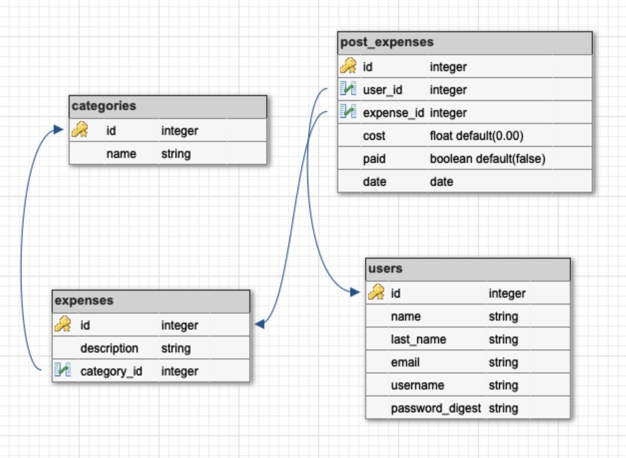

# Home Budget Friend App
Home budgeting process is complicated, yet an important aspect of wellbeing and success. The aim of "Home Budget Friend" is to easy the home budgeting pain and make of it an enjoyable experience.


## Wireframes and user stories

Please click the link below to see wireframes and user stories.

[Wireframes and User Stories](./Wireframes.md).

## Schema Diagram


## Technologies used
- **PostgreSQL**: As object-relational database.Versions 9.3 and up are supported.
- **Ruby on Rails**: Was used as server-side web application framework following MVC(Model, View, Controller) architectural pattern and RESTful desig.
- **FrontEnd React**: That consumed own generated /api/v1 implemented on the backend.
- **Heroku Deployment**: Applied continuous integration on deployment.

## Code snippet 
- Here is how the model was implemented for: many to many relationship post_expenses, that allow a user to have many expenses and an expense to be used by many users. Which is the main funtionality of the app.

- app/models/post_expense.rb
```ruby
class PostExpense < ApplicationRecord
    belongs_to :expense
    belongs_to :user

    # return a list of post expenses by user_id
    def self.get_post_expenses_by_user_id(id)
        return PostExpense.joins(:expense).where(post_expenses: {user_id: id})
                                        .select(:id, :description, :cost, :paid, :date, :category_id)
    end
end
```

- app/models/expense.rb
```ruby
class Expense < ApplicationRecord
  belongs_to :category
  has_many :post_expenses  
  has_many :users, through: :post_expenses
end
```

- app/models/user.rb
```ruby
class User < ApplicationRecord
    has_many :post_expenses  
    has_many :expenses, through: :post_expenses
    has_secure_password
    has_secure_token :auth_token

    def invalidate_token
      self.update(auth_token: nil)
    end
  
    def self.validate_login(username, password)
      user = find_by(username: username)
      if user && user.authenticate(password)
        user
      end
    end
end

```
## Agile methodology. 
- Basic kanban project board offered by GitHub was used througout the software development cycle. 

## Added bonus functionality:
- Authentication, as listed on the wireframes and user stories. 

## Link to deployed app

https://lit-anchorage-53218.herokuapp.com/

## Unsolved problems
- Heroku does not show styling as implemented and shown on wireframes.

## Features to be added in a later version
- Include error handling.
- Add a reporting page with more retrieve options such as: see all posted expenses by month and categories. 
- Improve styling on the home page: including background picture or video related to budget planning. 

## Instructions for downloading the code and running it on localhost
- Fork and clone the repo.
- In your terminal, run the following commands:
```
$ bundle install
$ rails db:seed
$ rails server
```
- If any issue is presented, please create an issue request on this repo.

## References:
- Bootstrap Navigation Bar
https://www.w3schools.com/bootstrap/bootstrap_navbar.asp

- The Ruby on Rails tutorial by Michael Hartl
https://www.learnenough.com

- Useful ways to visualize your data 
https://bigdata-madesimple.com/10-useful-ways-to-visualize-your-datawith-examples/
