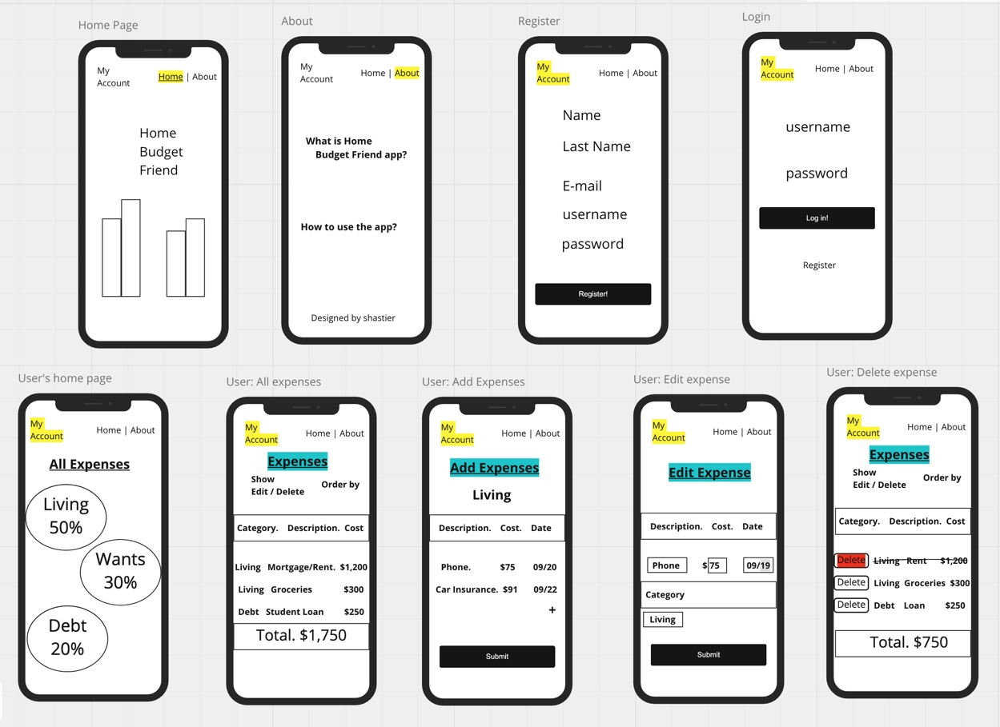

# Wireframes

Right-click & open in new window to see better!

# User Stories / http routes

## Home page
GET: '/'
- Show welcome message and background graphic / video related to budget planning. 
- Header right side: has a link to home and about pages.
- Header left side: has a link to user's page: My Account, that will allow the user to register or login.

### Authorization require
- Will allow the user to register. Got to "Register" page if first time user. 
- If the user has already an account, allow it to login and go to its "Home" page.

### No-Authorization require
- Will only see "Home" and "About" pages, which will explain how to use the app and why it is needed.

## Login / Registration flow

### Registration. First time user
POST: /user/new
- Allow user to register.
- Name, username and password are mandatory fields.
- Add validation: E-mail must include '@' and password should include at least one digit.
- Register button, will redirect to user's "Home" page.

### Login. User who was previously registered. 
GET: /auth/login
- Allow user to enter username & password. If that information matches with the DB's user login credentials 
then, redirect to user's "Home" page.
- Else, show message: "Please, try again, username/password does not match." Don't allow the user to login until the correct information is entered.
- Have a smaller link to register, in case the user doesn't have an account.

## User "Home" page / Add new expense
GET: /user
- Show a dashboard with three main categories: living, wants and debt.
- Those categories, will have a link to add expenses of that category.
- Will include a link to "All Expenses" page.

## See all expenses
GET: /expenses 
### Will allow user to:
- See a list of all expenses.
- Filter expenses by category.
- Order expenses by cost: ascending or descending.
- Show ttal at bottom of page.
- Edit / Delete options on the left, will only be visible if the user's select show Edit/Delete.

## Edit an expense
GET: /expenses/:id/edit
PUT: /expenses/:id
- This page is accessible from "All expenses" page when the user clicks edit.
- Will be pre-filled with the selected expense data. 
- User will update the expense as needed and click submit.
- The database will be updated accordingly. 

## Add expenses
POST: /expenses/:id/new
- This page is accessible from "User Home" page when the user clicks on one of the categories.
- Allow user to enter new expenses of the selected category.
- User can enter more than one expense at the same time if click the '+' a new emty row will show up.
- When done, the user will click submit button.
- The database will be updated accordingly. 

## Delete an expense
DETETE /expenses/:id
- From "All expenses" page, the user will be able to delete an item.
- Once deleted, that entry will be removed from the list and total amount will be updated.