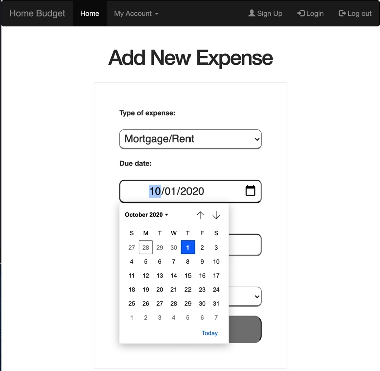

# Wireframes and User Stories

Right-click & open in new window to see better!

## Home page
- Show welcome message. 
- Header right side: has a link to Sign Up, Login and Log out.
- Header left side: has a link to user's page: My Account and Home page.

### No-Authorization require
- Will only see "Home" and "About" pages.

## About page
- Will explain step by step how to use the app and why it is needed.

### Authorization require
- Will allow the user to register. Got to "Sign Up" page if first time user. 
- If the user has already an account, allow it to login and go to its "Account" page.

## Login / Registration flow

### Registration. First time user
- Allow user to register.
- Register button, will redirect to user's "Home" page.

### Login. User who was previously registered. 
- Allow user to enter username & password. If that information matches with the DB's user login credentials then, redirect to user's "Account" page.
- Else, don't allow the user to login until the correct information is entered.

## User "Account" page
- Show all user's posted expenses.

## Add expenses
- This page is accessible from the "navigation bar" My Account / Add Expense 
- Allow user to enter new expense.

- Select expense type.

- Select expense due date.

- When all data is entered, the user will click "Add" button. The database will be updated accordingly. 

- Then, the user will click all expenses in order to be redirected to it's dashboard and see the new posted expense added and the total updated accordingly.

## See All Posted Expenses / Edit / Delete
- This page is accessible from "navigation bar" My Account / "All expenses" 

### Will allow user to:
- See a list of all posted expenses.
- Show total at bottom of page.
- Edit / Delete options on each posted expense.

## Edit a posted expense
- This page is accessible from "navigation bar" My Account / "All expenses" / Edit desired posted expense.

- Will be pre-filled with the selected expense data. 
- User will update the expense as needed.

- When done, the user will click Edit button.
- The database will be updated accordingly. 

## Delete a posted expense
- This page is accessible from "navigation bar" My Account / "All expenses" / Delete desired posted expense.
- Once the user click Delete button and refresh the page, that posted expense will be removed from the list and total amount will be updated.