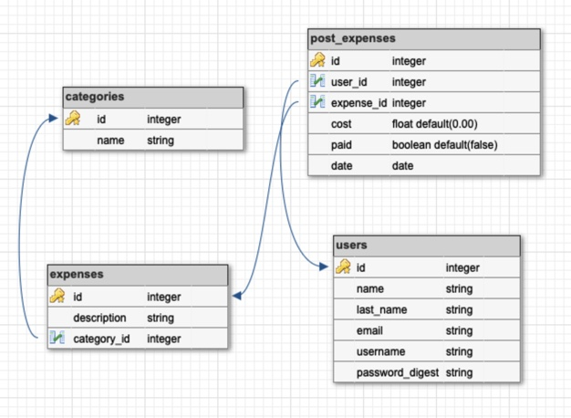

# Shirley Hastier / September 17, 2020 

## Home Budget Friend App Proposal

### What is your project?

Home budgeting process is complicated, yet an important aspect of wellbeing and success. The aim of "Home Budget Friend" is to easy the home budgeting pain and make of it an enjoyable experience. 

### Wireframes

Please click the link below to see wireframes and user stories.

[Wireframes and User Stories](./Wireframes.md).

### Schema Diagram

### Initial thoughts on app structure

Create a full stack application with all CRUD features using React as Frontend framework and Ruby on Rails as the backend REST API. 
- Languages: JavaScript (Frontend) and Ruby (Backend)
- Will inclue: user Authentication as a bonus functionality.
- Implement different queries to the database for easy data representation to the user such as filter by category and order by cost (ascending or descending).

### Why Ruby on Rails as a Backend Technology?
- Because it follows MVC(Model, View, Controller) and RESTful desig.
- It is quick and easy to build with minimal or zero config, thanks to all the built in generators.
- Take advantage of using Active Record as an ORM Framework and all its benefis such as perform database operations in an object-oriented approach and validate models before they get persisted to the database.
- It is used by high profile sites, including: GitHub and Airbnb.

### Phases of Completion
- Research and learn how to use Ruby on Rails.
- Wireframes and User Stories
- Database design. Schema diagram.
- Create Git reppo.
- Create and add tasks to project board on GitHub/Projects/Basic Kanban.
- Project Proposal.
- Draft list of exposed http routes.
- Create full project directory.
- Setting up server.
- Check that server is connected to database and running properly.
- Deploy initial project on Heroku.
- Start working on implementation as listed on project board to do tasks(same as user stories per below) and detailed on wireframes.
- Complete minimum viable product(MVP).
- Start working on nice to have features.
- Complete Readme.md file.
- Final test deployed app.
- Prepare project presentation.  

### Links and Resources

- Server-side web frameworks
https://developer.mozilla.org/en-US/docs/Learn/Server-side/First_steps/Web_frameworks 

- Why should you use budgeting app?
https://www.nerdwallet.com/blog/finance/budgeting-saving-tools/ 

- Best Expense Tracker Apps of 2020
https://www.thebalance.com/best-expense-tracker-apps-4158958

- 50/30/20 budget guideline
https://www.nerdwallet.com/blog/finance/how-to-build-a-budget/